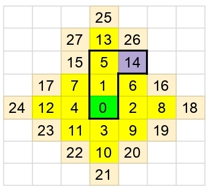

# Pathfinding BFS AI

Este projeto consiste em um sistema de navegação automática de um robô utilizando o algoritmo de busca em largura.

A região de busca é determinada por um arquivo de entrada (.csv), contendo as posições de partida, de destino e um mapa 42x42.

A movimentação da busca é realizada somente na vertical e horizontal, seguindo o padrão norte, leste, sul e oeste (N->L->S->O), assim como na figura abaixo, em que a cor verde representa o ponto de partida, a cor lilás representa o destino, as células amarelas representam as posições por onde o algoritmo percorreu, as em bege representam as células presentes na fila, sendo elas as próximas a serem executadas.

Tipo | Cor | Valor (CSV) | Custo
:---: | :---: | :---: | :---:
Sólido e plano | Verde | 1 | 1
Montanhoso | Marrom | 2 | 5
Pântano | Azul | 3 | 10
Fogo | Vermelho | 4 | 15